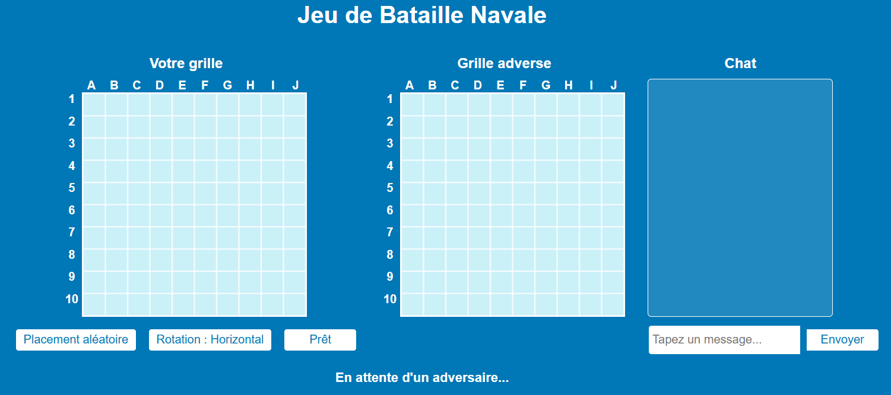
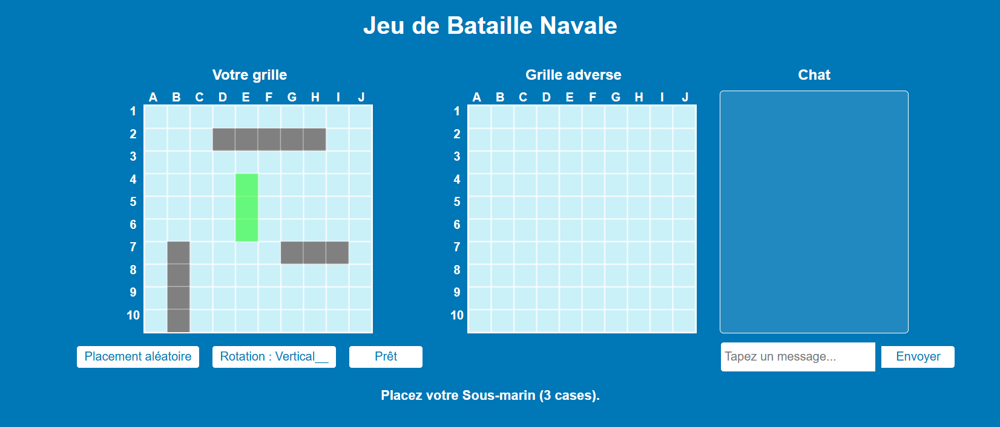
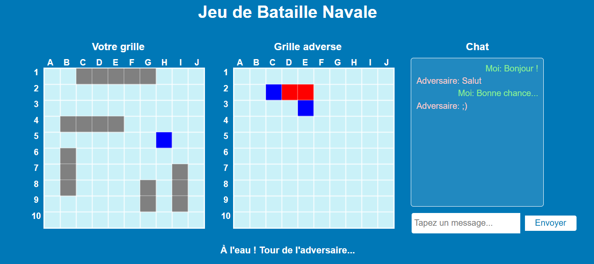
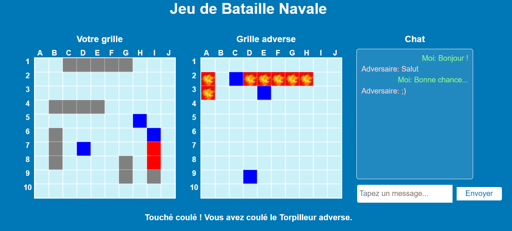

# Bataille Navale en Ligne

Bienvenue dans le projet de Bataille Navale en ligne ! Ce projet est une implémentation du jeu classique de Bataille Navale, où deux joueurs peuvent s'affronter en temps réel. Le projet utilise Node.js, Express, et Socket.IO pour gérer la communication en temps réel entre les joueurs.

## Table des Matières

1. [Description](#description)
2. [Fonctionnalités](#fonctionnalités)
3. [Installation](#installation)
4. [Utilisation](#utilisation)
5. [Contribution](#contribution)
6. [Licence](#licence)

## Description

La Bataille Navale est un jeu de stratégie où chaque joueur place des navires sur une grille et tente de couler les navires de l'adversaire en devinant leurs positions. Ce projet permet de jouer en ligne contre un autre joueur en temps réel.

## Fonctionnalités

- **Interface Utilisateur Réactive** : Grilles interactives pour placer les navires et attaquer l'adversaire.
- **Communication en Temps Réel** : Utilisation de Socket.IO pour des mises à jour instantanées.
- **Système de Salles** : Gestion de plusieurs parties simultanées.
- **Chat Intégré** : Permet aux joueurs de communiquer pendant la partie.
- **Effets Sonores et Visuels** : Améliore l'expérience de jeu avec des sons et des animations.

## Installation

Pour installer et exécuter ce projet localement, suivez ces étapes :

1. **Cloner le Dépôt** :
   ```bash
   git clone https://gitlab.ec-lyon.fr/aleronde/bataillenavale.git
   cd bataille-navale-en-ligne
   ```

2. **Installer les Dépendances** :
   ```bash
   npm install
   ```

3. **Démarrer le Serveur** :
   ```bash
   npm start
   ```

4. **Accéder à l'Application** :
   Ouvrez votre navigateur et allez à `http://localhost:3000` pour jouer au jeu en local.
   
   Pour jouer en ligne, vous pourrez à l'occasion (nous ne mettons pas le jeu en ligne à toute heure) ouvrir votre navigateur à l'adresse suivante : https://AdamLucasBatailleNavale.up.railway.app/

## Utilisation

1. **Connexion au Jeu** :
   - Ouvrez deux fenêtres de navigateur ou utilisez deux appareils pour simuler deux joueurs.
   - Chaque joueur doit accéder à l'URL du serveur pour rejoindre une partie.
   

2. **Placement des Navires** :
   - Placez vos navires sur la grille en utilisant l'interface de placement.
   - Vous pouvez utiliser le placement aléatoire ou placer manuellement vos navires.
   

3. **Début de la Partie** :
   - Une fois les navires placés, cliquez sur "Prêt" pour indiquer que vous êtes prêt à commencer.
   - La partie commence lorsque les deux joueurs sont prêts.

4. **Jouer au Jeu** :
   - Cliquez sur les cases de la grille adverse pour attaquer.
   - Les résultats des attaques (touché, manqué, coulé) sont affichés en temps réel.
     
     

5. **Fin de la Partie** :
   - Le jeu se termine lorsque tous les navires d'un joueur sont coulés.
   - Vous pouvez redémarrer une nouvelle partie en cliquant sur "Rejouer", cela redémarre alors une partie pour les deux joueurs présents dans le salon.

## Contribution

Les contributions sont les bienvenues ! Pour contribuer :

1. Forkez le dépôt.
2. Créez une branche pour votre fonctionnalité (`git checkout -b feature/nouvelle-fonctionnalite`).
3. Commitez vos modifications (`git commit -m 'Ajout d'une nouvelle fonctionnalité'`).
4. Poussez vers la branche (`git push origin feature/nouvelle-fonctionnalité`).
5. Ouvrez une Pull Request.

## Licence

Ce projet est sous licence MIT. Voir le fichier [LICENSE](LICENSE) pour plus de détails.

---
